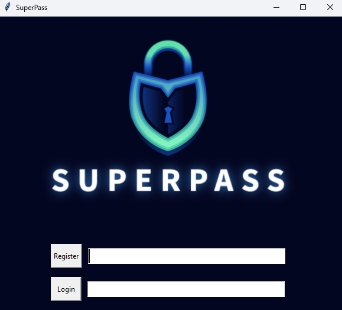
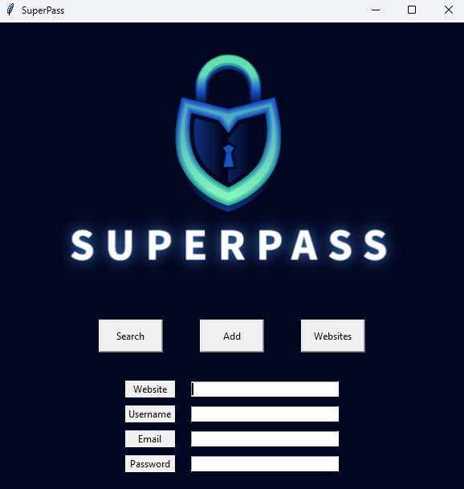

# SuperPass

## A password manager application for desktops built with Python 

SuperPass is a simple password manager built with Python and tkinter that aims to make storing and retrieving passwords quick and easy. It has a simple GUI and allows users to store account details
along with their passwords. The user can set a master password and then log in and start saving and
viewing their password data.  

The project was a good oportunity to practise OOP concepts, how to work with JSON data, using encryption and hashing to store password data, and how to build a GUI using Python's tkinter
library.

## Demo

 
 
 
 

## Instructions

#### Step 1
To run SuperPass, clone the git repo and then run main.py, or alternatively download and run the main.exe file found in the dist folder.

#### Step 2

After running the program, you will need to set a master password in order to log in and start saving passwords.

#### Step 3
Once logged in, you will have the option to either view a saved password, add a new password, or view a list of saved websites with password data.